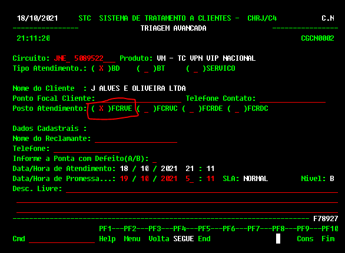
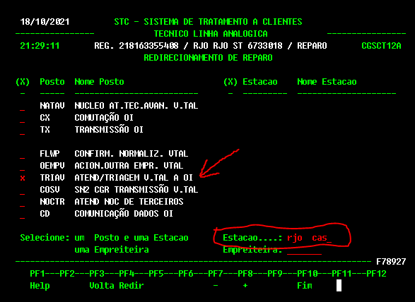

<link href="retro.css" rel="stylesheet" type="text/css" />

#### Divisão de Tarefas

**Abra em outra janela do navegador ->**
[Clique aqui para ver a Divisão de Tarefas Monitoração - TARDE](https://monitoracao-oi.notion.site/8697d40f5e0a4c3fbdc83419643f24af?v=62eb5f45ccb74ebca2188829589540d8)

#### Horário de Janta

O horário de janta ficara e critério da equipe decidir.
Favor seguir as boas praticas abaixo.

- Use o **BOM SENSO !**.
- Não saia no mesmo horário de alguém, combine com a equipe antes. (Não abandone o colega com a fila fritando.)
- **Todos somos adultos !**

#### A Divisão das equipe

A divisão é feita na tentativa de balancear as equipes na quantidade de pessoas para não sobrecarregar ninguém.
Se quiserem internamente dividir os cliente pode.

[Clique aqui para ver a Divisão de Tarefas Monitoração - TARDE](https://monitoracao-oi.notion.site/8697d40f5e0a4c3fbdc83419643f24af?v=62eb5f45ccb74ebca2188829589540d8)

O link leva a uma tabela que sera atualizada todo dia.
Abra em uma guia separado do navegador, dentro do Teams esta dando erro.

#### Os grupos no WhatsApp

São somente para a **ABERTURA** e **TS** são somente para isso. Os GT's dos cliente estão nesse grupos, se o cliente perguntar sobre a tratativas não precisamos responder.

#### O Posto FCR o outros

**Todos** vão passar por la para aprender.
A ideia é ir trocando toda a semana.

**FCR**

O posto **FCR é exclusivo para casos que estão pendente TS.** Devemos criar e mandar pra frente quando temos a informação de energia e reset nos equipamentos.

**FCRVE**

Para casos que não estão modelados no ARS e precisam de abertura manual. Encaminhar para o posto FCRVE. Deixar lá pendente TS.
**Não esqueça de deixa o caso pendente.**
*(De preferencia pendente ate o Natal ... hahhaha)*

**FCRDE - Posto de retorno**

É o nosso posto de retorno. Caso mandarmos para o posto errado irão mandar de volta no posto FCRDE, essa ação foi combinada com os outros postos da OI/V.TAL.

#### Casos OEMP

**Não abrimos mais o reparo com a parceira** a equipe de Curitiba ira abrir e seguir com a tratativa.

Porem, **devemos fazer o TS normalmente.** 
Se o cliente confirmar a energia e reset OK e for operadora parceira devemos tramitar para o posto OEMP. Em caso de pegar trecho da V.tal mandar para o posto TRIAV conforme procedimento.

#### Posto TRIAV

Posto da V.TAL para a triagem dos circuitos de gerencia SDH.
Esta com erro na hora da tramitação, onde se deve colocar a estação RJO CAS paa não mandar para o "limbo" o reparo.

