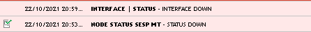
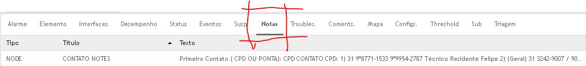
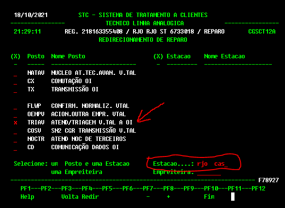
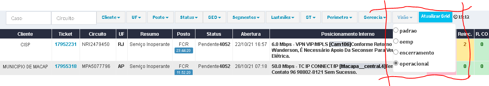
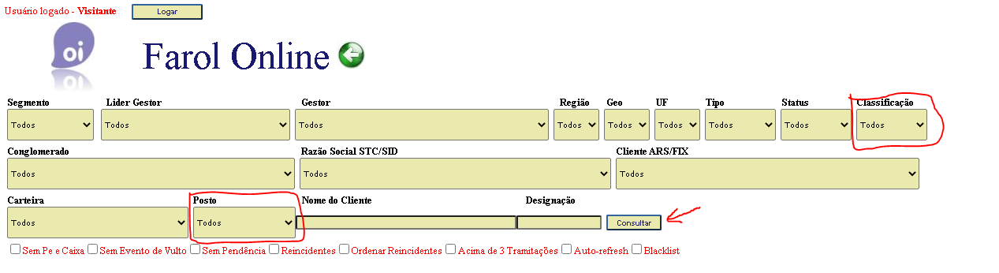
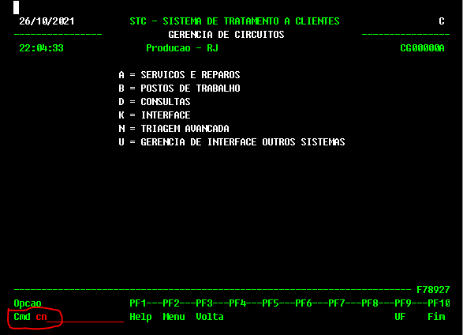
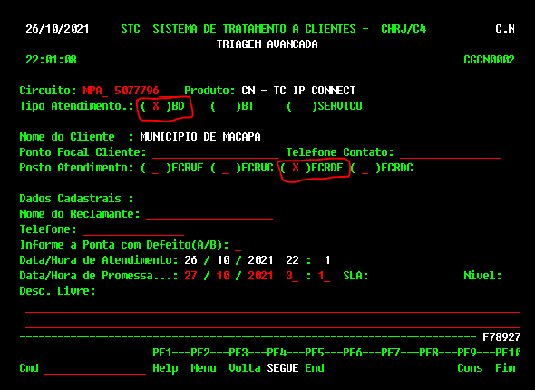

<link href="retro.css" rel="stylesheet" type="text/css" />

#### Divisão de Tarefas

**Abra em outra janela do navegador ->**
[Clique aqui para ver a Divisão de Tarefas Monitoração - TARDE](https://monitoracao-oi.notion.site/8697d40f5e0a4c3fbdc83419643f24af?v=62eb5f45ccb74ebca2188829589540d8)

#### Horário de Janta

O horário de janta ficara e critério da equipe decidir.
Favor seguir as boas praticas abaixo.

- Use o **BOM SENSO !**.
- Não saia no mesmo horário de alguém, combine com a equipe antes. (Não abandone o colega com a fila fritando.)
- **Todos somos adultos !**

#### A Divisão das equipe

A divisão é feita na tentativa de balancear as equipes na quantidade de pessoas para não sobrecarregar ninguém.
Se quiserem internamente dividir os cliente pode.

[Clique aqui para ver a Divisão de Tarefas Monitoração - TARDE](https://monitoracao-oi.notion.site/8697d40f5e0a4c3fbdc83419643f24af?v=62eb5f45ccb74ebca2188829589540d8)

O link leva a uma tabela que sera atualizada todo dia.
Abra em uma guia separado do navegador, dentro do Teams esta dando erro.

## **Os grupos no WhatsApp**

São somente para a **ABERTURA** e **TS** são somente para isso.

[Lista de clientes com grupos no WhatsApp](https://gabbamendonca.github.io/apps-oi-monitoracao/grupos)

Os GT’s dos cliente estão nesse grupos, se o cliente perguntar sobre a tratativas não precisamos responder.

## FLEX4

**Alarmes**

Na FLEX possuímos diversos alarmes, porem, só tratamos o alarme de link inoperante, o "**NODE STATUS - STATUS DOWN**".

O restante dos alarmes como o "**INTEFACE \| STATUS - INTERFACE DOWN**“ podemos ignorar.

**Contatos do CPD**

 Todos os contatos e anotações sobre os clientes estão no campo NOTES/Flex4.

## OEMP

**Não abrimos mais o reparo com a parceira** a equipe de Curitiba ira abrir e seguir com a tratativa.

Porem, **devemos fazer o TS normalmente.** Se o cliente confirmar a energia e reset OK e for operadora parceira devemos tramitar para o posto OEMP. 

Em caso de pegar trecho da V.tal mandar para o posto TRIAV conforme procedimento.

## TRIAV

**Posto TRIAV**

Posto da V.TAL para a triagem dos circuitos de gerencia SDH. Esta com **erro na hora da tramitação**, onde se deve colocar a **estação RJO CAS** para não mandar para o “limbo” o reparo.

## O Posto FCR e outros

- **FCR - Pendente TS**

O posto **FCR é exclusivo para casos que estão pendente TS.**

Se atentar na abertura ! Se não for possível o contato com o cliente no momento da abertura, o posto oficial para o primeiro contato (confirmação de energia e TS) é o FCR. 

**CUIDADO PARA NÃO ESQUECER NO NOC !** 

Estamos deixando chamados parados no posto NOC. Toda nossa gestão está centralizada no posto FRC. Devemos enviar todos os chamados abertos para esse posto.

**NÃO ESQUEÇA DE DEIXA O CASO PENDENTE !**

Sempre **encaminhar para o FCR e deixar pendente** no ARS. A data para jogar na pendencia é **sempre de 1 mês para a frente ou mais.** *(De preferencia pendente ate o Natal … hahhaha)*, quando for encaminhar para o posto responsável retire da pendencia.

- **Grid de FCR**

Os casos no posto FRC podem ser vizualizados para ferramenta oi360.

[Link para a ferramenta Oi360](http://10.111.26.12/oi360s/grid?operacional)

Em visão selecionar a opção operacional.

- **Gestão do Posto FCR**

1. Testar se o link normalizou antes de mandar para frente.
2. Tentar contato com o cliente a cada 2h.
3. Se tiver dificuldade devemos acionar o GT.
4. Todos os casos no posto FCR precisam ser assumidos pelo colaborador que está tratando, isso faz parte da Gestão do posto e temos maior controle sobre as ações de cada um.
5. Alimentar informações no OI360 e ARS/STC. Todas ações do CGS nos chamados devem estar registradas no OI360 e ARS/STC.
6. Todo caso em que for necessário encaminhar ao TRIAV, devemos tramitar para estação **RJO CAS**.
7. Antes de mandar para frente, confirmar se o reparo estava na pendencia e se não tiver, retroagir para não ir para campo vencido.
8. Reparos abertos pelo robo podem ser encaminhados para frente sem contato com o cliente.
9. Veirificar os casos novos para saber se o robo fez a abertura de algum caso critico ou concentrador.

- **FCRDE - Posto de retorno**

É o nosso posto de retorno. Caso enceminharmos para o posto errado, este, ira mandar de volta no posto FCRDE, essa ação foi combinada com os outros postos da OI/V.TAL.

Podem ser verificados pelo farol online.

[Farol Online](http://10.121.241.11/apoio_informacao/farol/farol_online/index.php)

Selecionar em **CLASSIFICAÇÃO** todos.

Selecionar em **POSTO** o **FCRDE**.

Clicar em **CONSULTAR**.

- **FCRDE - Abertura Manual**

Casos abertos manualmente no STC devem sempre ser abertos na opção CN e encaminhar ao FCRDE e segur o procedimento normal enviando ao posto correspondente.

## Missão Critica e Concentradores

Cliente **NEOENERGIA** e todos alarmes **Missão Critica** e **Concentradores** se não conseguir TS enviar para o TRIAV ou posto correspondente.

## Preventivas

Não se trata nenhum **reparo** da gerencia premium como **preventiva** sem o consentimento do gestor tecnico.

Devemos encerrar a preventiva e seguir com as tratativas.

Cliente Sicoob não precisamos fazer TS, assim que alarmar podemos mandar para frente.

